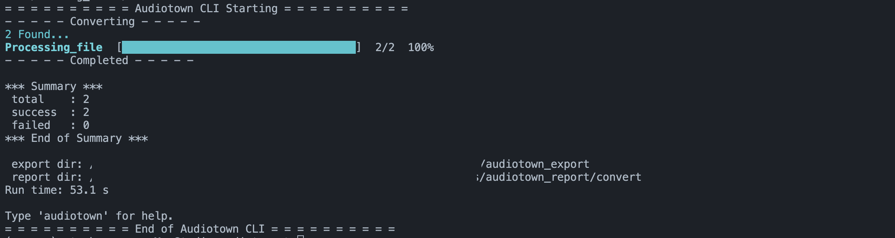

# Summary

## A lightweight, high-performance CLI for managing audio libraries. Optimized for FLAC to Apple-friendly (ALAC/AAC) conversion with smart deduplication.

1. Optimized for FLAC-to-Apple-friendly conversion, Audiotown scans large music folders quickly, summarizes what is in your collection, and converts `.flac `files into .m4a using either `ALAC` (lossless) or `AAC` (lossy). [know more about the codec](https://ffmpeg.org/ffmpeg-codecs.html).
2. It preserves important metadata during conversion, including artist, album, track information, and embedded artwork.
3. In practical use, it can scan a folder with roughly 13,000 files in about 50-60 seconds, making it suitable for large personal libraries.

## whats new

1. added video upgrade feature via `--to-video` flag. it trancodes (converts) legacy `AVI` and `RMVB` files into Apple safe MP4. 
   1. Output format: H264/AAC 192K
   2. Maximium compability with Apple Hardwares, including iPhone 4 or later.
   3. `audiotown convert '/my/path/to/video_folder/' --to-video=mp4`
2. improved terminal output.
3. Bug fixing.

## Prefer a Mac app instead?

If you are interested in a native macOS app for this workflow, check out Audiotown Pro.
It brings the same core idea into a dedicated desktop experience: scan your library, inspect what is in it, and convert .flac files into Apple-friendly `.m4a` audio with `ALAC` or `AAC`, while preserving metadata and artwork from the original files.

[Learn more about Audiotown Pro](https://holleratme.gumroad.com/l/dclqyl)

# CLI Commands

1. `audiotown` contains three commands: `check`, `stats` and `convert`. This package requires `ffmepg` installed in the system. 
   1. To run them, type `auditown check` or `audio stats` or `audio convert`.
   2. Type `audiotown check` to run `check`. 
   3. The command checks if `ffmpeg` is installed.
2. `stats` acts as an executive assisant for audio media management. Personal media library are often messy. This command starts by searching the `folder` recursively and laser focus ONLY on audio files (filtered by file suffix). It then prints out to the terminal a summary report based on what it finds: 
   1. numbers of songs by formats, by encoder types,
   2. storage usage details, 
   3. what top artists, genres, albums are to me ,
   4. are they lossless or lossy, and 
   5. detect potential unreadable or corrupt files. 
3. `stats` can export scanned records into a JSON via `--report-path` flag. Default value is `.` (current directory).
4. `convert`. It converts all `.flac` files in a folder into lossless (`alac`) or lossy (`aac`) versions. An apple lossless encoded `.m4a` file can be recognized in Apple eco system but not usually for `.flac` files. 
   1. `--report-path` is available in `convert` too. To run it `audiocheck convert /path/to/flacs --encoder=alac --report-path=.`. The converted will be exported to a new folder `audiotown_export` in the same folder `path/to/flacs`. 
   2. `convert` also supports `--dry-run` as a tool to preview changes made in a conversion.
   3. `convert` searches files recursively so I can specify a high-level `folder` like `Media` or `myMediaHub`. Try with one ablum folder first.
   4. `convert` supports `--bitrate` when the `--encoder=aac` is specified. the default bitrate kbps is `256k`. `128k` and `320k` are the other valid inputs.
   5. `convert` by default tries to add artwork into files when converting. It searches for `cover.jpg` or `library.jpg` at the root of the folder. if the source file does not contain an artwork, the command attempts to find such file and embed it into the output whenever possible.
5. `convert` now supports a new video transcode flag `--to-video=mp4`. It tranforms the old AVI files into Apple ready MP4. Output files will be saved under a new subfolder named `audiotown_exported`.


## Demo
- 
- 
- 

# Installation
1. Ensure I have [FFmpeg](https://ffmpeg.org/download.html) installed on the system. It is the powerhouse that does the conversion and other heavy work like probing `ffprobe`. Will need it installed and working. MacOS users can install it via [homebrew](https://formulae.brew.sh/formula/ffmpeg): `brew install ffmpeg`.
2.   >=3.10. 
3. Requires `click` and `wcwidth` libaries.

```zsh
# [optional but recommended] set up a virutal env named `my_env`.
python3 -m venv my_env
source my_env/bin/activate
# check python version 3.10+
python --version 

# udpate pip
pip install --upgrade pip

pip install audiotown

# help
audiotown
```
# 🛠 Usage

```txt
Usage: audiotown [OPTIONS] COMMAND [ARGS]...
Options:
  --version   Show the version and exit.
  -h, --help  Show this message and exit.

Commands:
  check    Verify that FFmpeg and dependencies are correctly installed.
  convert  Convert FLACs in FOLDER to Apple-friendly formats.
  stats    Stats Dashboard & Insight tool.
```

## Examples

1. The simplest way to use `AudioTown` is to run it in a folder containing FLAC files: `audiotown convert /path/to/album/folder --codec=alac --report-path=/path/to/report/folder --dry-run`. The search is recursive.\[=po-iu9o0[]\
2. . the output files from `audio convert` are under the subfolder `audiotown_export/` within `/path/to/album/folder`.
3. The `/path/to/report/folder` can be `.` or any specified directories.
4. use `--dry-run` to preview any perceived changes.
5. The `convert` takes only `flac` files. It supports: `flac --> alac` or `flac --> aac`.
   1. `--bitrate` can be specified for `flac --> aac` (default: `256k`)

```zsh
# 1. show additional help 
audiotown
audiotown -h
audiotown --help

# 2. check ffmpeg installation
audiotown check

# 3. show stats of a media folder 
cd /path/to/media/folder
audiotown stats . 
# alternatively 
audiotown stats  /path/to/media/folder
audiotown stats  /path/to/media/folder --report-path=.

# enable duplicating searching
audiotown stats  /path/to/media/folder --find-duplicate --report-path=. 

# 4. convert all flac files  to alac (default) or aac based formats. logging is controlled by `--report-path`
# . means current directory
audiotown convert . --report-path=.
audiotown convert . --codec=alac --report-path=. --dry-run
audiotown convert . --codec=aac --bitrate=256k --report-path=. --dry-run


# 5. video upgrade. source formats: AVI, RMVB
audiotown convert '/my/path/to/video_folder/' --to-video=mp4 --report-path
```

## Advanced Options
1. overview

  |Option|	Description|	Default|
  |:---|:---|---:|
  |`--codec`|	alac or aac. used with `convert`. |alac|
  |`--bitrate`|	Bitrate for AAC (128k, 256k, 320k). only useful when `--codec=aac`|	256k|
  |`--dry-run`|	Preview conversion without writing files. used with `convert`	|disabled|
  |`--find-duplicate`| finds potential duplicate files by parallel comparisions via `arist`, `title` and `file_name`.|
|disabled|
  |`--report-path`|	generates a full log, including a json. work with both `convert` and `stats`.	|disabled|

2. Examples
   1. Run a preview to see what would be converted:

    ```zsh
    # preview the conversion that will be done to any flac files in `AlbumFolder`. 
    audiotown convert ./AlbumFolder --dry-run
    ```

   2. use `codec` and `--bitrate`. It means the desired codec used for the output. 
  
    ```zsh
    audiotown convert . --codec=alac 
    audiotown convert . --codec=aac --bitrate=256k 
    audiotown convert . --codec=aac --bitrate=128k 
    ```

   3. It does not make sense to specify `bitrate` for lossless `alac` so `bitrate` will be ignored.

    ```zsh
    cd /my/media/folder
    audiotown convert . --codec=alac --bitrate=128k 
    ```
   4. find duplicates. the command looks at the metadata like aritst, title, file size and file name. it tries to find a unique key to create duplicate groups/sets.

    ```zsh
    cd /my/media/folder
    audiotown stats . --find-duplicate
    ```
    5. video transcoding
      ```zsh
      ```
## 🤝 Contributing

`Audiotown` is a labor of love built to handle my own 100GB+ library. If you find a file that crashes the scan, or if you have an idea to make the Apple-conversion even smoother, I’d love your input!

### How to Help:
* **Report Bugs:** Open an [Issue](https://github.com/zjgcainiao/audiotown/issues) if a specific audio format causes a hiccup. Please include the output of your `meta.txt`!
* **Feature Requests:** Want a specific target bitrate or a new "Theme" for the progress bar? Let me know in the Issues.
* **Code:** Pull Requests are welcome! 
    1. Fork the repo.
    2. Create a feature branch (`git checkout -b feature/AmazingFeature`).
    3. Commit your changes.
    4. Push to the branch and open a PR.

# LICENSE
Licensed under the [MIT License](https://raw.githubusercontent.com/zjgcainiao/audiotown/main/LICENSE).
